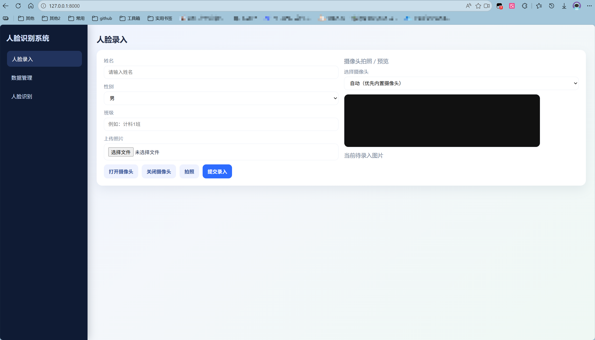

# 前后端人脸识别系统（Face Identify）

基于本地人脸特征的人脸录入、管理与识别演示项目：后端使用 **FastAPI** 提供 REST 与 WebSocket，前端为单页 **HTML/CSS/JavaScript**，通过浏览器摄像头与接口完成录入与实时识别。

运行main.py，然后浏览器打开访问 http://127.0.0.1:8000 ，如图所示：


---

## 技术栈

| 层级 | 技术 |
|------|------|
| 后端框架 | [FastAPI](https://fastapi.tiangolo.com/) |
| ASGI 服务器 | [Uvicorn](https://www.uvicorn.org/)（`main.py` 中 `reload=True` 开发模式） |
| 人脸识别 | [face_recognition](https://github.com/ageitgey/face_recognition)（底层依赖 [dlib](https://github.com/davisking/dlib)） |
| 数值计算 | NumPy |
| 图像读取 | Pillow（PIL） |
| 数据校验 | Pydantic（如 `UserUpdateBody` 模型，部分接口以 Form 为主） |
| 数据持久化 | Python `pickle` 文件 `data/user_data.pkl`，人脸照片存 `data/images/` |
| 跨域 | `CORSMiddleware`，允许任意来源（开发友好） |
| 前端 | 原生 HTML/CSS/JS；[MediaDevices / getUserMedia](https://developer.mozilla.org/zh-CN/docs/Web/API/MediaDevices/getUserMedia)、Canvas、`fetch`、`WebSocket` |

**依赖安装提示（Windows 常见情况）：** `face_recognition` 需可用的 Python 环境与 dlib；若安装困难，可参考官方文档或预编译 wheel。主要 Python 包：`fastapi`、`uvicorn[standard]`、`face_recognition`、`numpy`、`pillow`、`python-multipart`（上传表单需要）。

---

## 功能概览

1. **人员录入**：表单（姓名、性别、班级）+ 上传图片或摄像头拍照，写入人脸库。  
2. **人员管理**：列表展示、搜索/筛选/排序、单条编辑与删除、一键清空。  
3. **图片识别**：上传单张图片，返回图中每张人脸的框与匹配姓名。  
4. **实时识别**：摄像头画面经 WebSocket 持续送服务端，叠加框与姓名。  
5. **静态资源**：已录入用户头像通过 `/data/images/...` 访问。

---

## 功能与实现说明

### 1. 人员录入

- **前端**（`index.html`）：「录入」页收集 `name`、`gender`、`class_name`，图片来源为文件 `<input type="file">` 或摄像头：`getUserMedia` → 隐藏 canvas 抓帧 → `canvas.toBlob` 得到 JPEG，与表单一起构造 `FormData`。  
- **后端**（`POST /api/enroll`）：`validate_profile` 校验；`image_bytes_to_array` 用 PIL 转 RGB 数组；`extract_single_encoding` 用 `face_recognition.face_locations` + `face_encodings` 取**第一张脸**的 128 维特征；`find_duplicate_user` 与库中所有人比距离，小于 `ENROLL_DUPLICATE_TOLERANCE`（0.45）则拒绝重复录入；通过后分配自增 `id`，图片写入 `data/images/`，`pickle` 保存用户记录（含 `face_encoding` 列表形式）。

### 2. 人员管理

- **列表**：`GET /api/users` 返回脱敏后的用户（不含原始特征向量），前端 `state.users` 缓存，`renderManageTable` 渲染表格。  
- **搜索/筛选/排序**：纯前端 `getFilteredSortedUsers()`，按姓名/班级关键字、性别、录入时间或姓名/班级排序。  
- **更新**：`PUT /api/users/{id}`，表单字段可选；若上传新图则重新提特征、删旧图、更新路径与 `image_url`。  
- **删除**：`DELETE /api/users/{id}` 删库中记录与磁盘照片；`DELETE /api/users/all` 清空全部并复位 `next_id`。

### 3. 图片识别

- **前端**：`FormData` 只含 `file`，调用 `POST /api/recognize/image`。  
- **后端**：对图中**所有人脸**分别 `face_encodings`，每张脸用 `match_encoding` 与库中所有人比 `face_distance`，取最小距离；若最小距离 `< TOLERANCE`（0.52）则视为命中并返回 `user_id`，否则姓名为「未知」。返回每张脸的 `bbox`（top/right/bottom/left）及 `name`、`distance`、`user_id`。

### 4. 实时识别（WebSocket）

- **前端**：建立 `WebSocket` 至 `ws://<host>/ws/recognize`（页面用 `http`→`ws` 替换推导 `WS_BASE`）；定时器约每 120ms 将 video 帧画到 canvas 再 `toBlob` JPEG（质量 0.65），以**二进制**发送；`realtimeAwaitingResponse` 避免上一帧未返回就堆积发送。收到 JSON 后 `drawFaces` 在叠加 canvas 上按视频显示区域缩放绘制框与姓名。  
- **后端**：`receive()` 接受 `bytes` 或 `data:image...;base64` 文本；大图宽超过 640 时先缩小再检测以减轻 CPU，再把框坐标按缩放比例映射回原图尺寸；识别逻辑与多脸匹配同 `match_encoding`。

### 5. 人物详情与头像

- 识别结果点击姓名后，若有 `user_id` 则 `GET /api/users/{user_id}` 拉取详情；头像 URL 为 `image_url`（相对路径），与 `API_BASE` 拼接显示。  
- **静态文件**：`app.mount("/data/images", StaticFiles(...))` 映射到 `data/images`。

### 6. 健康检查

- `GET /api/health` 返回 `{"status":"ok"}`，便于探活或联调。

---

## HTTP / WebSocket 接口说明

基础 URL：默认服务为 `http://0.0.0.0:8000`（本机访问常用 `http://127.0.0.1:8000`）。  
错误时统一通过异常处理返回 JSON：`{"error": "<详情>"}`（与 FastAPI 默认 `detail` 字段在部分客户端需兼容，前端 `apiFetch` 会读 `error` 或 `detail`）。

### 页面与静态

| 方法 | 路径 | 说明 |
|------|------|------|
| GET | `/` | 返回项目根目录 `index.html` |
| GET | `/index.html` | 同上 |
| GET | `/data/images/{filename}` | 用户头像等静态图片 |

### REST API

| 方法 | 路径 | 请求 | 成功响应要点 |
|------|------|------|----------------|
| GET | `/api/health` | 无 | `{"status":"ok"}` |
| POST | `/api/enroll` | `multipart/form-data`：`name`, `gender`, `class_name`, `file` | `message`, `user`（公开字段，无特征） |
| GET | `/api/users` | 无 | `total`, `users[]` |
| GET | `/api/users/{user_id}` | 无 | `user`（单条公开信息） |
| PUT | `/api/users/{user_id}` | `multipart/form-data`：可选 `name`, `gender`, `class_name`, `file` | `message`, `user` |
| DELETE | `/api/users/{user_id}` | 无 | `message` |
| DELETE | `/api/users/all` | 无 | `message`, `deleted`（删除条数） |
| POST | `/api/recognize/image` | `multipart/form-data`：`file` | `count`, `faces[]`（含 `bbox`, `name`, `distance`, `user_id`） |

### WebSocket

| URL | 客户端发送 | 服务端推送 |
|-----|------------|------------|
| `ws://<host>/ws/recognize` | JPEG 二进制 **或** Base64 图片字符串（支持 `data:image/...;base64,` 前缀） | `{"faces":[...], "count": n}` 或 `{"error":"..."}` |

---

## 运行方式

在项目目录下（需已安装依赖）：

```bash
python main.py
```

或使用：

```bash
uvicorn main:app --host 0.0.0.0 --port 8000 --reload
```

浏览器访问 `http://127.0.0.1:8000` 即可使用界面。

---

## 项目优点（简要）

1. **结构清晰**：单文件 `main.py` 集中路由、存储与识别逻辑，前端单页完成交互，便于学习与二次开发。  
2. **双通道识别**：同一套 `match_encoding` 支撑 HTTP 单图与 WebSocket 实时流，行为一致。  
3. **体验细节**：录入/实时支持多摄像头选择、内置摄像头优先策略；实时识别大图降采样减轻延迟；框坐标与视频显示区域映射，叠加显示较自然。  
4. **数据与隐私边界**：列表与 API 返回使用 `to_public_user`，不向客户端泄露 `face_encoding` 原始向量。  
5. **防重复录入**：录入阶段用更严阈值比对已有用户，减少同一人多次建档。  
6. **标准技术选型**：FastAPI 自动生成 OpenAPI，REST 语义明确，WebSocket 适合低延迟连续帧场景。

---

## 其他

- `demo/` 目录含独立小脚本（如两张图比对人脸距离），与主服务无强制耦合，可作算法试验。  
- 生产环境需替换宽松 CORS、考虑数据库替代 pickle、HTTPS/WSS 与访问控制等，本仓库定位为本地/教学演示。
